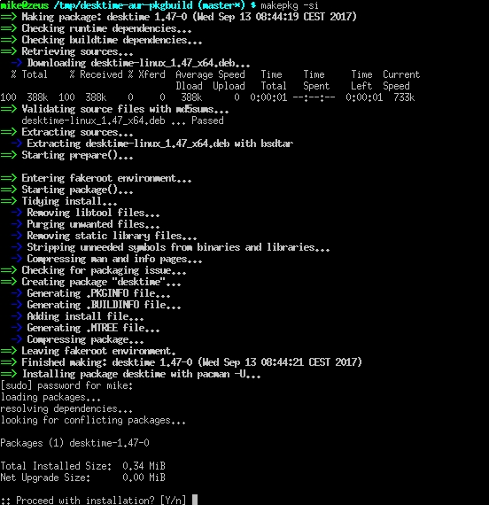

# Desktime AUR pkgbuild
Upgrade due out-of-date at https://aur.archlinux.org/packages/desktime/

Just download
```
cd /tmp
git clone https://github.com/mikaelz/desktime-aur-pkgbuild.git
```

And install `makepkg -si`


